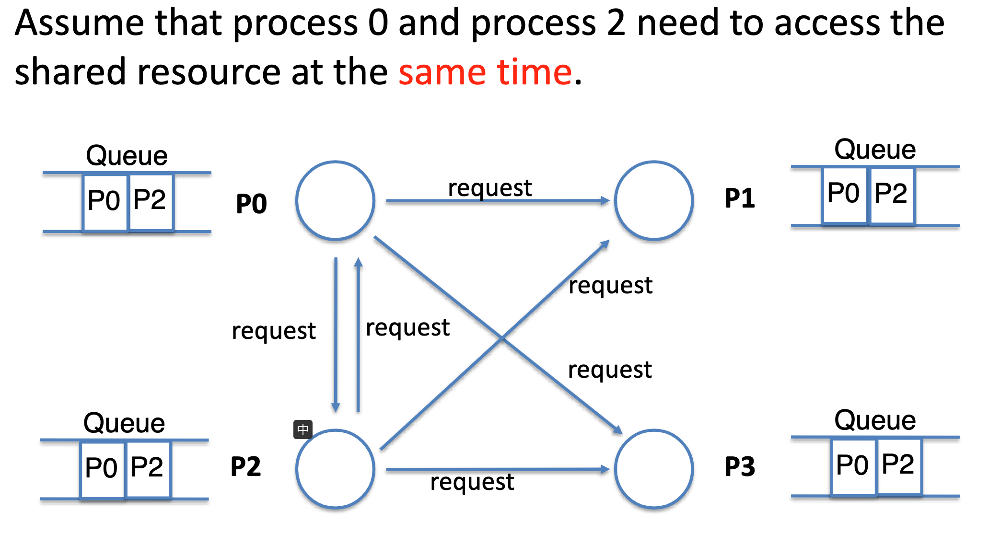

## Project 1: Blockchain Demo based on Lamport Logic Clocks

### Description

Refer to the project [description](./result/Winter23_CS271_Project1.pdf) for details.

### Brief thoughts of solutions

**Data structures**

- `Transaction`: basic transaction information, as well as for data verification for HTTP GET/POST communication.
- `Block`: a primitive encapsulation of a transaction, with additional properties `next_block` and `previous_hash` and the method `hash()` to calculate the hash value of itself.
- `BlockChain`: a chain of blocks. When it add a new transaction via `add_transaction`, it will firstly append a corresponding block to it and resort all blocks according to their Lamport logic clock values `(sender_logic_clock, sender_id)`, and then recompute all hash values.
- `Server`: Singleton, defined in `server.py`.
- `Client`: Singleton, defined in `client.py`. Each registered `client` among the system holds an identical `blockchain`, a sending message queue `sending_quque` and a receiving message queue `message_queue`.


**Distributed communication and processing approaches**
In our implementation, each communication is an HTTP request-response process realized by Python `requests`/`grequests` libraries and `FastAPI` framework.

- "Balance" is not mutual exclusive, so it is instantly responded by the `server`. When a `client` sponsors a "balance", it communicates only with the `server`, and its `logic_block` increases (local event).
- "Transfer" is mutual exclusive cause the `server` can only process one transfer transaction at one time. Herein the "Lamport distributed exclusion protocol" is used for the mutual exclusive purpose.
  - When one `client` sponsors a "transfer", it firstly increase its `logic_clock` (send event) and broadcasts this request to all other `client`s, and anticipates to received their replies. The `client` also put this transfer transaction into its `sending_queue` and `message_queue`.
  - When one `client` receives this kind of request, its `logic_clock` increases (receive event) and sends a reply to the sender, as well as puts this transfer transaction into its `message_queue`.
  - There is a `TimeLoop` scheduler for each `client` that is in charge of checking whether there is any sponsored transaction on the head of `sending_queue` and begin to process it once conditions are satisfied: (1) the transfer transaction is on the head of `sending_queue`; (2) it received replies from all other `clients`s for this transaction; (3) it is also on the head of `message_queue`.
  - To process a transaction, the `client` first sends a "balance" request to the `server`.
    - If `balance < amount`, the transfer transaction is ABORT. The `client` broadcasts a transaction release (finished) signals to all other clients.
    - If `balance >= amount`, the `client` continue to send a "transfer" request to the `server` to update balances of the `client` and its receiver. Then transaction is SUCCESS. 
    - Whether ABORT or SUCCESS, the `client` broadcasts a transaction release (finished) signals to all other clients, and then add the transaction to its `blockchain`.
  - When one`client` receives a transaction release signal, it add it to its `blockchain` and removes the transaction from its `message_queue` (not necessarily the head of `message_queue`).


### Usage:

Change current directory to `./src/`, then:

1. start the bank server by using `python server.py`

2. start some clients: You can subsequently use `python client.py` in different terminals.

3. Then you can interact with all these server and client terminal interfaces.

The figure below shows the demonstration of the program.


### Comments:

The conventional "Lamport distributed protocol" it too ideal as the figure below depicts. It cannot work well if no additional strategies.




Take the case of three clients and they operate almost simultaneously as follows:
1. Client 3: `t 1 12` (Client 1 transfers $12 to Client 1)
2. Client 2: `t 3 5` (Client 2 transfers $5 to Client 3)
3. Client 3: `t 1 11` (Client 3 transfers $11 to Client 1)

In realistic-scenario testing, there always appears the phenomenon:
- Client 1: `message_queue = [Transaction(2, 3, 5), Transaction(3, 1, 12)]`, `sending_queue = []`
- Client 2: `message_queue = [Transaction(2, 3, 5), Transaction(3, 1, 12)]`, `sending_queue = [Transaction(2, 3, 5)]`
- Client 3: `message_queue = [Transaction(3, 1, 12)]`, `sending_queue = [Transaction(3, 1, 12)]`

during communication. At this time point, actually Client 3 regards that its first transaction is satisfied to be processed, although. Since for any distributed system, it is non-sharing and non-status, the procedure of processing `Transaction(3, 1, 12)` cannot be held back. So both `sending_queue` and `message_queue` are necessary and convenient for message processing. To ensure the consistency of all `client`s' `blockchain`s, once a transaction is added to the chain, the chain is resorted and all hash values are recomputed. Thus the results could be as follows:

*Print balance records of the `server`:*

```
client_id	balance	
        1	21.0	
        2	5.0	
        3	4.0	
```

*Print the blockchain of any one `client`:*

```
--------------------
Total blocks: 3
----------
Block 0:
  transaction: sender_id=2 recipient_id=3 amount=5.0 sender_logic_clock=1 timestamp='2023-02-09T15:53:07' status='SUCCESS' num_replies=2
  previous_hash: e3b0c44298fc1c149afbf4c8996fb92427ae41e4649b934ca495991b7852b855
  hash: d8c6863a066b71d88dafc2591a348090e3b0584450859303be6cf511ccbd5509
  next_block: Block(transaction=(3, 1, 12.0), timestamp=2023-02-09T15:53:06)

Block 1:
  transaction: sender_id=3 recipient_id=1 amount=12.0 sender_logic_clock=1 timestamp='2023-02-09T15:53:06' status='ABORT' num_replies=2
  previous_hash: d8c6863a066b71d88dafc2591a348090e3b0584450859303be6cf511ccbd5509
  hash: 0dc6184c624767629ba4ab8774dc3ec7cecd1dee2a82f019f942e5bdb9276f84
  next_block: Block(transaction=(3, 1, 11.0), timestamp=2023-02-09T15:53:09)

Block 2:
  transaction: sender_id=3 recipient_id=1 amount=11.0 sender_logic_clock=2 timestamp='2023-02-09T15:53:09' status='SUCCESS' num_replies=2
  previous_hash: 0dc6184c624767629ba4ab8774dc3ec7cecd1dee2a82f019f942e5bdb9276f84
  hash: 6fbcb8096fe8eb362bab89710c49211acc5402cce53baccc098caff072705768
  next_block: None
```


In the above case, the processing sequence is `Transaction(2, 1, 12) -> ABORT, Transaction(2, 3, 5) -> SUCCESS, Transaction(3, 1, 12) -> SUCCESS`. While the final blockchain's sequence is `Transaction(sender_logic_clock=1, 2, 3, 5, SUCCESS), Transaction(sender_logic_clock=1, 3, 1, 12, ABORT), Transaction(..., 2, 1, 11, SUCCESS)`. 
