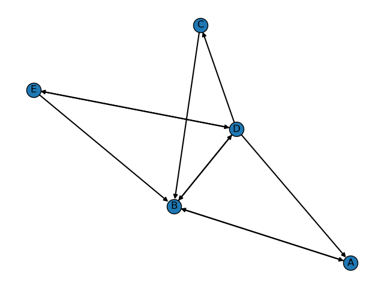

## Project 2: Chandy-Lamport Global Snapshot Algorithm

### Description

Refer to the project [description](./result/Winter23_CS271_Project2.pdf) for details.

In the system implementation, we mainly use async and concurrent operations when sending HTTP requests and handling them. Due to the token-passing application and the marker-passing strategy is independent from each other, "thread" is also an needed primitive in this system.


### Brief thoughts of solutions

**Data structures**

- `Client`: This singleton-pattern class represents each client process.
- `SnapShot`: It includes both `LocalState`s and `ChannelState`s, and can represent both a local snapshot and the global snapshot. Each `SnapShot` is identified by a `stamp` data field, meaning that there could exist many global snapshot activities simultaneously.
- Key methods of `Client`:
    - `init_global_snapshot`: global snapshot initiation function called by the initiator
    - `init_global_snapshot_passively`: view function of [client-address/initialization](), passively called by other clients once they are notified by the initiator
    - `send_message`: token passing function
    - `recv_message`: view function of [client-address/message]()
    - `send_marker`: marker sending function
    - `recv_marker`: , view function of [client-address/marker]()
    - `send_snapshot`: to send its local snapshot to the initiator
    - `recv_snapshot`: view function of [client-address>/snapshot]()


**Chandy-Lamport global snapshot protocol**

In our implementation, each communication is an HTTP request-response process realized by Python `requests`/`grequests` libraries and `FastAPI` framework.


Notationally, global state $GS$ is defined as 
$$
GS = \{\cup_i LS_i, \cup_{i,j} CS_{i,j}\}
$$

where $LS_i$ is the local state of process $i$, and $CS_{i,j}$ is the $i\rightarrow j$ channel state.

The ultimate goal of global snapshot protocol is to satisfy the consistency conditions:
- C1: $\rm{send}(m_{i,j}) \in LS_i \Rightarrow m_{i,j}\in SC_{i,j} \,\oplus\, \rm{recv}(m_{i,i})\in LS_j$
- C2: $\rm{send}(m_{i,j}) \notin LS_i \Rightarrow m_{i,j}\notin SC_{i,j} \,\land\, \rm{recv}(m_{i,j})\notin LS_j$


<!-- - Key properties of `Client`:
    - `has_recorded: Dict[str, bool]`: whether the `Client` has recorded its local state for a specific global snapshot activity, marked by the `stamp` field 
    - `markers_recv_nums: Dict[str, int]`: the number of markers received by the `Client` for a specific global snapshot activity, marked by the `stamp` field
    - `snapshots_recv_nums: Dict[str, int]`: the number of local snapshots received by the `Client` for a specific global snapshot activity, marked by the `stamp` field   -->

The specific steps of the Chandy-Lamport global snapshot algorithm are as follows:

1. Any process can initiate this global snapshot algorithm by executing the "Marker Sending Rules" -- recording its local state and then sending markers on all outgoing channels.

2. A process executes the "Marker Receiving Rule" on receiving a marker.
   - if it has not yet recorded its local state, it records the corresponding channel's state as "empty", and executes the "Marker Sending Rule" to record its local state.
   - otherwise, record the corresponding channel's state as {all received messages along this channel before receiving the marker and after j's state is recorded}.
  
3. Algorithm terminates when each process has received a marker on all of its incoming channels. Then there will not be any marker sent for this global snapshot activity.

4. Each process sends its local snapshot to the initiator. In practice, only the following two conditions are satisfied simultaneously, the initiator could regard that this global snapshot activity is completed: 1) It has received all the local snapshots from all other processes; 2) It has received all the markers from all its incoming channels. So the process begin a check procedure when 1) it receives a marker as well as when 2) it receives a local snapshot.


Simple analysis of the protocol:
- C1 satisfied: Any message that is sent by a process before recording its snapshot, must be recorded in the global snapshot.
- C2 satisfied: Any message that is sent by a process after recording its snapshot, must not be recorded in the global snapshot.

Where "recording" means the process executed the "Marker Sending Rules". It includes two situations:
-  It is the initiator and send markers to its outgoing channels.
-  It is not the initiator and received the first marker and then send markers to its outgoing channels.


### Usage:


The layout of the system (five clients) is as follows:




1. Start the five clients by using `python client.py` in five different terminals.

2. Input commands in any one of five clients at any time as prompts.

```
Commands:
  1. <st>: start token passing from this client
  2. <is>: initiate a global snapshot from this client
  3. <all>: display all info of current client
  4. <exit>, <quit>, or <q>: exit the client interface
```


### Comments:

*A question worthy of consideration is that -- Why does the lecture say that FIFO channel ensures that messages received from markers will not be recorded in the channel state?*

<!-- TODO: 为什么lecture中说 FIFO channel 保证了收到 marker 之后的 message 一定不会被记录在 channel state 中？ -->


